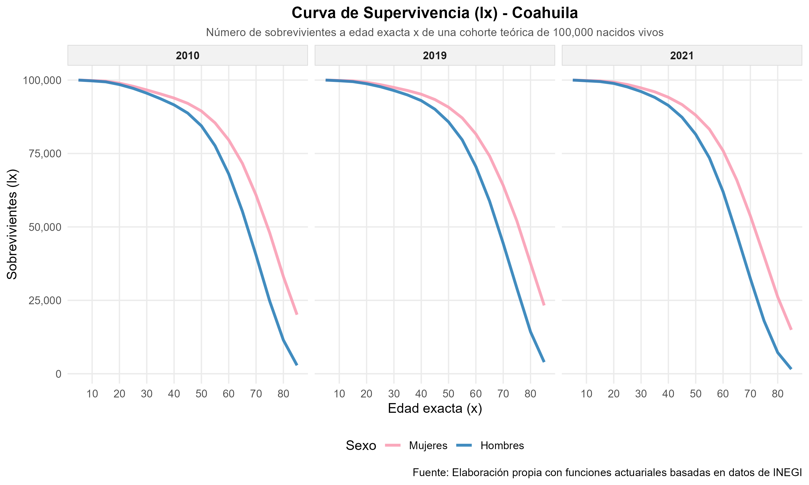
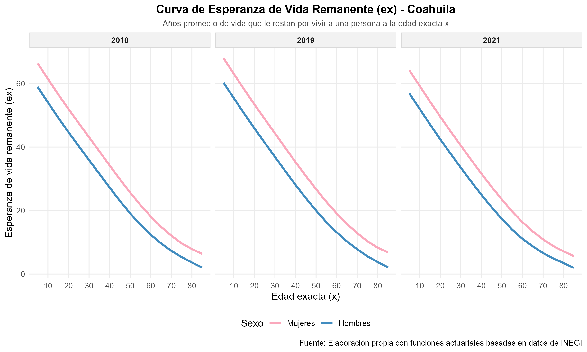
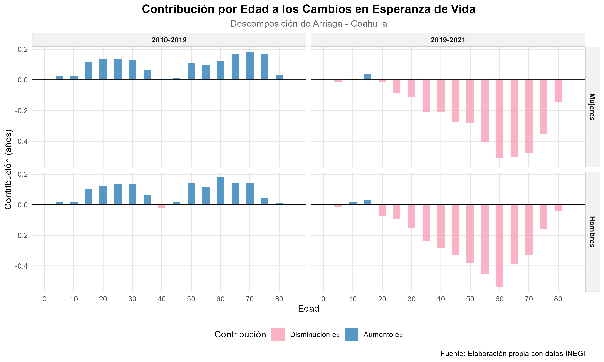
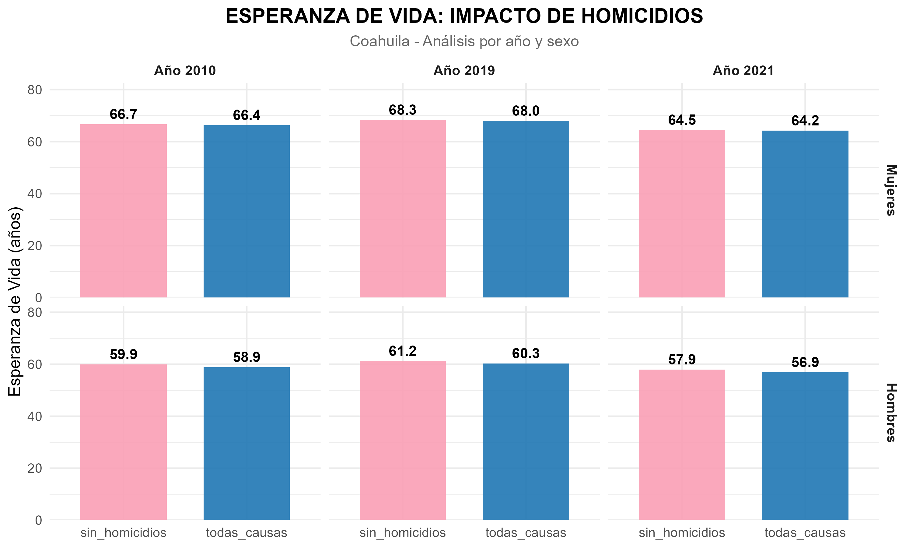
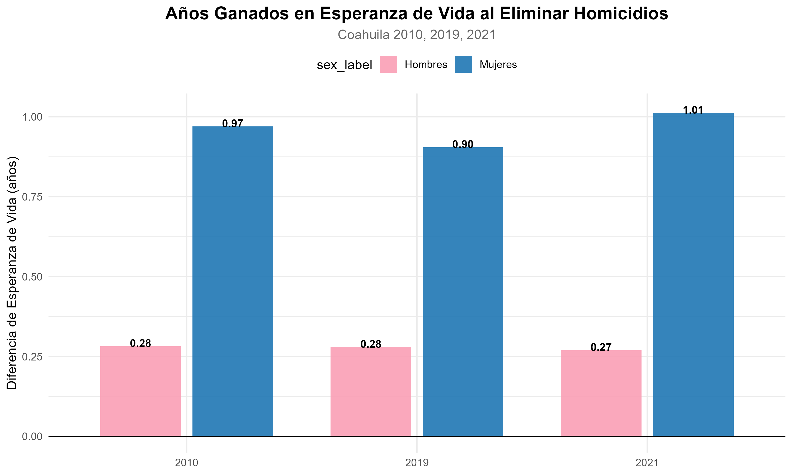
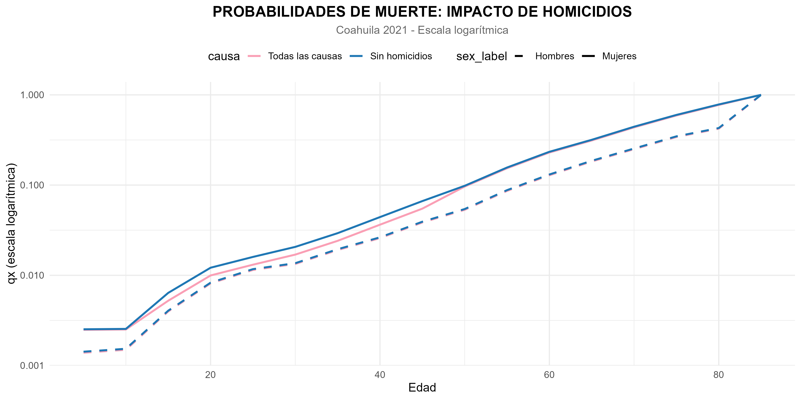

```{r}
#| include: false

knitr::opts_chunk$set(
  fig.align = "center",
  fig.width = 4.5,
  fig.height = 3.5
)
```

## Introducción

Coahuila de Zaragoza, ubicado en el noreste de México, es una entidad que destaca por su extensión territorial, su alto nivel de urbanización, su desarrollo industrial y su papel estratégico dentro de la dinámica migratoria nacional e internacional. Al ser el tercer estado más grande del país, después de Chihuahua y Sonora, Coahuila posee una ubicación geográfica privilegiada que lo conecta tanto con otras regiones del norte de México como con la frontera de Estados Unidos. Esta posición ha influido de manera importante en su crecimiento económico, en la distribución de su población y en los movimientos migratorios que atraviesan su territorio.

De acuerdo con el Censo de Población y Vivienda 2020 del INEGI, Coahuila contaba con 3,146,771 habitantes, con una distribución casi equilibrada entre mujeres y hombres. La mayor parte de su población reside en zonas urbanas, principalmente en municipios como Saltillo, Torreón, Ramos Arizpe, Monclova, Piedras Negras y Ciudad Acuña, los cuales concentran buena parte de la actividad económica, industrial y laboral del estado. Esta urbanización se relaciona directamente con el desarrollo de sectores productivos como el automotriz, metalúrgico, manufacturero y minero, que han convertido a Coahuila en un polo de atracción para trabajadores y familias provenientes de otras entidades del país. 

En el ámbito sociodemográfico, Coahuila muestra rasgos de modernización social, como la disminución gradual de los nacimientos, el aumento de la esperanza de vida y un promedio de escolaridad superior a la media nacional. Estos elementos reflejan cambios en la estructura familiar, en las condiciones de vida y en la preparación educativa de su población. Al mismo tiempo, su estabilidad económica y su baja informalidad laboral han fortalecido su capacidad para atraer migración interna, especialmente hacia regiones como la Sureste, donde destacan Saltillo y Ramos Arizpe, y la Laguna, encabezada por Torreón.

La migración constituye un aspecto fundamental para comprender la realidad actual de Coahuila. A nivel nacional, el estado recibe población de entidades como Nuevo León, Veracruz, San Luis Potosí y Zacatecas, principalmente por motivos laborales vinculados con la industria y la manufactura. Sin embargo, también ha funcionado históricamente como un estado expulsor hacia otros destinos del norte, particularmente Nuevo León, debido a oportunidades de empleo, educación o reunificación familiar. Esta doble condición muestra que Coahuila participa activamente en los procesos de movilidad interna del país.

En cuanto a la migración internacional, la ubicación fronteriza de Coahuila le otorga un papel relevante como zona de tránsito, cruce, retorno y repatriación. Ciudades como Piedras Negras y Ciudad Acuña son puntos estratégicos en la movilidad de personas hacia Estados Unidos, así como en los procesos de devolución de connacionales y extranjeros. Por ello, las autoridades estatales y municipales han tenido que implementar estrategias de atención, incluyendo la habilitación de albergues y espacios temporales para responder a las necesidades de la población migrante.

En conjunto, Coahuila puede entenderse como una entidad de gran importancia económica, demográfica y migratoria dentro del norte de México. Su desarrollo industrial, su perfil urbano, su cercanía con Estados Unidos y su capacidad para atraer población hacen de este estado un espacio clave para analizar los cambios sociales, laborales y territoriales que caracterizan a la región fronteriza mexicana.

### Pirámide de población de Coahuila 2026

```{r}
# 1. Instalar y cargar paquetes
#install.packages("ggplot2", dependencies = TRUE)
#install.packages("data.table", dependencies = TRUE)
#install.packages("kableExtra")

# 2. Cargar paquetes
library(data.table)
library(ggplot2)
library(kableExtra)

# 3. Remover los objetos
rm(list = ls())

# 4. Descargar datos
pop <- fread("https://repodatos.atdt.gob.mx/CONAPO/proyecciones/00_Pob_Mitad_1950_2070.csv")


# 5. Filtrar Coahuila 2026
coah <- pop[ENTIDAD == "Coahuila" & ANIO == "2026",
            .(SEXO, EDAD, POBLACION)]

# 6. Preparar los datos para la pirámide
pop_coah<- pop[ENTIDAD == "Coahuila" & ANIO == 2026, .(SEXO, EDAD, POBLACION)]

# 7. Convertir población masculina a valores negativos para graficar
pop_coah[, POBLACION := ifelse(SEXO == "Hombres",-POBLACION, POBLACION)]

# 8. Graficar pirámide poblacional
ggplot(pop_coah, aes(x = EDAD, y = POBLACION, fill = SEXO)) +
  geom_bar(stat = "identity", width = 1) +
  coord_flip() +
  scale_y_continuous(labels = abs) +
  labs(title = "Pirámide poblacional de Coahuila, 2026",
       x = "Edad",
       y = "Población") +
  theme_minimal() +
  scale_fill_manual(values = c("Hombres" = "steelblue", "Mujeres" = "pink"))
```

### Análisis de la pirámide de distribución poblacional de Coahuila en 2026

La pirámide poblacional de Coahuila muestra una base más estrecha en comparación con los grupos de edad adulta, lo que indica que nacen menos niños que en décadas anteriores. Al mismo tiempo, se observa un mayor número de personas en edades adultas y avanzadas, lo que refleja que la población está envejeciendo.

En el grupo de 0 a 14 años se aprecia una menor proporción de población, lo cual sugiere una disminución en los nacimientos. Esto puede tener consecuencias a futuro, ya que habrá menos personas que se incorporen a la vida laboral. Por otro lado, el grupo de 15 a 64 años concentra actualmente la mayor parte de la población, lo que representa una base importante para la actividad económica del estado.

En cuanto a las personas de 65 años y más, se observa un aumento considerable. Esto indica que la población vive más años que antes. También se aprecia que en las edades más avanzadas hay ligeramente más mujeres que hombres, situación común debido a que las mujeres suelen tener mayor esperanza de vida.

En general, la gráfica muestra que el estado de Coahuila enfrenta un proceso de envejecimiento poblacional. Esta situación puede generar retos en el futuro, como una mayor necesidad de servicios de salud y apoyo para las personas mayores, así como cambios en la organización económica y social del estado.

## **Diagrama de flujo**


## **Fórmulas Utilizadas**

*Tasa Específica de Mortalidad*

$$ {}_nm_x = \frac{{}_nD_x}{{}_nN_x} $$

donde:

${}_nm_x$: Tasa de mortalidad entre las edades $x$ y $x+n$

${}_nD_x$: Defunciones entre las edades $x$ y $x+n$

${}_nN_x$: Población entre las edades $x$ y $x+n$

*Suavizamiento por Media Móvil (3 años)* $$ {}_nD^s_x = \frac{{}_nD^{(y-1)}_x + {}_nD^{(y)}_x + {}_nD^{(y+1)}_x}{3} $$

donde:

${}_nD^s_x$: Defunciones suavizadas para el año $y$

${}_nD^{(y-1)}_x$, ${}_nD^{(y)}_x$, ${}_nD^{(y+1)}_x$: Defunciones en los años $y-1$, $y$, $y+1$

*Crecimiento Exponencial*

Se utilizó el método de crecimiento exponencial para interpolar la población entre censos. La fórmula utilizada es:

$$ N(t) = N_0 \cdot e^{r \cdot (t - t_0)} $$

donde:

-   $N(t)$: Población en el tiempo $t$

-   $N_0$: Población inicial

-   $r$: Tasa de crecimiento

-   $t_0$: Tiempo inicial

*Probabilidad de Supervivencia*

$$ {}_np_x = 1 - {}_nq_x $$

donde:

${}_np_x$: Probabilidad de sobrevivir entre las edades $x$ y $x+n$

*Tabla de Vida - Probabilidad de Muerte*

$$ q_x = \frac{n \cdot m_x}{1 + (n - a_x) \cdot m_x} $$

*Esperanza de Vida*

$$ e_x = \frac{T_x}{l_x} $$

*Descomposición de Arriaga*

$$ \Delta e_0 = \sum \left[ \frac{l_x^A}{l_0^A} \left( \frac{L_x^B}{l_x^B} - \frac{L_x^A}{l_x^A} \right) + \frac{T_{x+1}^B}{l_0^B} \left( \frac{l_x^A}{l_x^B} - \frac{l_{x+1}^A}{l_{x+1}^B} \right) \right] $$

*Cálculo de Sobrevivientes* $$ l_{x+n} = l_x \cdot {}_np_x $$donde:

-   $l_{x+n}$: Número de sobrevivientes a la edad $x+n$

-   $l_x$: Número de sobrevivientes a la edad $x$

-   ${}_np_x$: Probabilidad de supervivencia entre $x$ y $x+n$

*Cálculo de Defunciones entre Edades*

$$ {}_nd_x = l_x - l_{x+n} $$

o alternativamente:

$$ {}_nd_x = l_x \cdot {}_nq_x $$

donde:

${}_nd_x$: Defunciones ocurridas entre las edades $x$ y $x+n$

${}_nq_x$: Probabilidad de morir entre $x$ y $x+n$

*Años-Persona Vividos entre Edades*

$$ {}_nL_x = (n \cdot l_{x+n}) + ({}_na_x \cdot {}_nd_x) $$

Para el último grupo de edad: $$ {}_{\infty}L_{x^*} = \frac{l_{x^*}}{{}_{\infty}m_{x^*}} $$

*Años-Persona por Vivir* $$ T_x = \sum_{a=x}^{\omega} {}_nL_a $$

*Esperanza de Vida*

$$
e_x = \frac{T_x}{l_x}
$$

## **Código para los cálculos**

## Cálculo de Años Persona Vividos (APV) y Pirámides Poblacionales

*Cálculo de APV*:

Se calcula la población a mitad de año (APV) para 2010, 2019 y 2021 usando interpolación exponencial entre los censos de 2010 y 2020.

```{r, warning=FALSE, message=FALSE}
# ==============================================================================
# Cálculo de Años Persona Vividos (APV) y Pirámides Poblacionales: Coahuila
# ==============================================================================

# Carga de paquetes ----
library(readxl)
library(reshape2)
library(lubridate)
library(ggplot2)
library(data.table)
library(dplyr)

# Definición de la función expo (Incrustada para evitar el uso de archivos externos) ----
expo <- function(pop_0, pop_T, t_0, t_T, t) {
  # Convertir fechas a años decimales
  date_0 <- decimal_date(ymd(t_0))
  date_T <- decimal_date(ymd(t_T))
  
  # Tiempo transcurrido entre censos
  time_span <- date_T - date_0
  
  # Tasa de crecimiento exponencial (r)
  r <- log(pop_T / pop_0) / time_span
  
  # Estimación de la población al tiempo de interés 't'
  pop_t <- pop_0 * exp(r * (t - date_0))
  
  return(pop_t)
}

# Carga de tabla de datos ----
# (Asegúrate de haber corrido antes tu script de limpieza con los datos de Coahuila)
censos_pro <- fread("../Data/censos_pro.csv")


# ==============================================================================
# 1. CÁLCULO DE APV (POBLACIÓN A MITAD DE AÑO) ----
# ==============================================================================

# --- Año 2010 ---
N_2010 <- expo(censos_pro[year==2010] %>% .$pop, 
               censos_pro[year==2020] %>% .$pop, 
               t_0 = "2010-06-25", t_T = "2020-03-15", t = 2010.5)

apv2010 <- censos_pro[year==2010, .(age, sex)]
apv2010[, `:=`(N = N_2010, year = 2010)]


# --- Año 2019 ---
N_2019 <- expo(censos_pro[year==2010] %>% .$pop, 
               censos_pro[year==2020] %>% .$pop, 
               t_0 = "2010-06-25", t_T = "2020-03-15", t = 2019.5)

apv2019 <- censos_pro[year==2020, .(age, sex)]
apv2019[, `:=`(N = N_2019, year = 2019)]


# --- Año 2021 ---
N_2021 <- expo(censos_pro[year==2010] %>% .$pop, 
               censos_pro[year==2020] %>% .$pop, 
               t_0 = "2010-06-25", t_T = "2020-03-15", t = 2021.5)

apv2021 <- censos_pro[year==2020, .(age, sex)]
apv2021[, `:=`(N = N_2021, year = 2021)]


# --- Consolidar y guardar tablas históricas de APV ---
apv <- rbind(apv2010, apv2019, apv2021)
write.csv(apv, "../Data/apv.csv", row.names = FALSE)


# ==============================================================================
# 2. PROCESAMIENTO QUINQUENAL PARA GRÁFICOS ----
# ==============================================================================

apv_quinquenal <- copy(apv)

# Definir grupos quinquenales estándares (0-4, 5-9, ..., 85+)
apv_quinquenal[, age_group := cut(age, 
                                  breaks = c(0, seq(5, 85, by = 5), Inf),
                                  labels = c("0-4", "5-9", "10-14", "15-19", "20-24", 
                                             "25-29", "30-34", "35-39", "40-44", "45-49",
                                             "50-54", "55-59", "60-64", "65-69", "70-74",
                                             "75-79", "80-84", "85+"),
                                  right = FALSE)]

# Sumar la población (N) por año, grupo quinquenal y sexo
apv_quinquenal <- apv_quinquenal[, .(N = sum(N, na.rm = TRUE)), by = .(year, age_group, sex)]

# Asegurar el orden correcto de los factores de edad en el eje
apv_quinquenal$age_group <- factor(apv_quinquenal$age_group, 
                                   levels = c("0-4", "5-9", "10-14", "15-19", "20-24", 
                                              "25-29", "30-34", "35-39", "40-44", "45-49",
                                              "50-54", "55-59", "60-64", "65-69", "70-74",
                                              "75-79", "80-84", "85+"))


# ==============================================================================
# 3. GENERACIÓN DE PIRÁMIDES POBLACIONALES (COAHUILA) ----
# ==============================================================================

# Asegurar que existan las carpetas de destino para que ggsave no falle
if(!dir.exists("images/apv")) dir.create("images/apv", recursive = TRUE)

# --- Gráfica Coahuila 2010 ---
ggplot(apv_quinquenal[year == 2010], aes(x = age_group, y = ifelse(sex == "male", -N/1e6, N/1e6), fill = sex)) +
  geom_col(width = 0.7, alpha = 0.8) +
  coord_flip() +
  scale_y_continuous(
    labels = function(x) paste0(abs(x), "M"),
    breaks = scales::pretty_breaks(n = 8)
  ) +
  scale_fill_manual(
    values = c("male" = "#2c7fb8", "female" = "#fa9fb5"),
    labels = c("male" = "Hombres", "female" = "Mujeres")
  ) +
  labs(
    title = "Pirámide Poblacional de Coahuila 2010",
    subtitle = "Distribución por grupos quinquenales de edad y sexo",
    x = "Grupo de edad",
    y = "Población mitad de año (millones)",    
    fill = "Sexo",
    caption = "Fuente: INEGI"
  ) +
  theme_minimal() +
  theme(
    legend.position = "bottom",
    plot.title = element_text(hjust = 0.5, face = "bold", size = 14),
    plot.subtitle = element_text(hjust = 0.5, color = "gray40"),
    axis.text.y = element_text(size = 8),
    panel.grid.major.y = element_blank()
  )
ggsave("images/apv/apv_2010.png", width = 10, height = 6, dpi = 300)


# --- Gráfica Coahuila 2019 ---
ggplot(apv_quinquenal[year == 2019], aes(x = age_group, y = ifelse(sex == "male", -N/1e6, N/1e6), fill = sex)) +
  geom_col(width = 0.7, alpha = 0.8) +
  coord_flip() +
  scale_y_continuous(
    labels = function(x) paste0(abs(x), "M"),
    breaks = scales::pretty_breaks(n = 8)
  ) +
  scale_fill_manual(
    values = c("male" = "#2c7fb8", "female" = "#fa9fb5"),
    labels = c("male" = "Hombres", "female" = "Mujeres")
  ) +
  labs(
    title = "Pirámide Poblacional de Coahuila 2019",
    subtitle = "Distribución por grupos quinquenales de edad y sexo",
    x = "Grupo de edad",
    y = "Población mitad de año (millones)",    
    fill = "Sexo",
    caption = "Fuente: INEGI"
  ) +
  theme_minimal() +
  theme(
    legend.position = "bottom",
    plot.title = element_text(hjust = 0.5, face = "bold", size = 14),
    plot.subtitle = element_text(hjust = 0.5, color = "gray40"),
    axis.text.y = element_text(size = 8),
    panel.grid.major.y = element_blank()
  )
ggsave("images/apv/apv_2019.png", width = 10, height = 6, dpi = 300)


# --- Gráfica Coahuila 2021 ---
ggplot(apv_quinquenal[year == 2021], aes(x = age_group, y = ifelse(sex == "male", -N/1e6, N/1e6), fill = sex)) +
  geom_col(width = 0.7, alpha = 0.8) +
  coord_flip() +
  scale_y_continuous(
    labels = function(x) paste0(abs(x), "M"),
    breaks = scales::pretty_breaks(n = 8)
  ) +
  scale_fill_manual(
    values = c("male" = "#2c7fb8", "female" = "#fa9fb5"),
    labels = c("male" = "Hombres", "female" = "Mujeres")
  ) +
  labs(
    title = "Pirámide Poblacional de Coahuila 2021",
    subtitle = "Distribución por grupos quinquenales de edad y sexo",
    x = "Grupo de edad",
    y = "Población mitad de año (millones)",    
    fill = "Sexo",
    caption = "Fuente: INEGI"
  ) +
  theme_minimal() +
  theme(
    legend.position = "bottom",
    plot.title = element_text(hjust = 0.5, face = "bold", size = 14),
    plot.subtitle = element_text(hjust = 0.5, color = "gray40"),
    axis.text.y = element_text(size = 8),
    panel.grid.major.y = element_blank()
  )
ggsave("images/apv/apv_2021.png", width = 10, height = 6, dpi = 300)

```

## Tablas de vida - Coahuila 

*Tablas de vida*:

Se unen las defunciones con los $APV$ y se calcula la tasa de mortalidad $mx$

```{r, warning=FALSE, message=FALSE}
# ==============================================================================
# TABLAS DE VIDA - COAHUILA
# ==============================================================================

# ------------------------------------------------------------------------------
# 1. PAQUETES ----
# ------------------------------------------------------------------------------

library(data.table)
library(dplyr)
library(tidyr)
library(DT)

# ------------------------------------------------------------------------------
# 2. CARGAR DATOS ----
# ------------------------------------------------------------------------------

apv <- fread("../Data/apv.csv")
def <- fread("../Data/def_pro.csv")

# ------------------------------------------------------------------------------
# 3. HOMOLOGAR SEXOS ----
# ------------------------------------------------------------------------------

apv$sex <- tolower(apv$sex)
def$sex <- tolower(def$sex)

# Convertir a M y F
apv$sex[apv$sex == "male"] <- "M"
apv$sex[apv$sex == "female"] <- "F"

def$sex[def$sex == "male"] <- "M"
def$sex[def$sex == "female"] <- "F"

# ------------------------------------------------------------------------------
# 4. UNIR BASES ----
# ------------------------------------------------------------------------------

tv <- merge(
  apv,
  def,
  by = c("year", "age", "sex"),
  all.x = TRUE
)

# ------------------------------------------------------------------------------
# 5. LIMPIEZA ----
# ------------------------------------------------------------------------------

tv$deaths[is.na(tv$deaths)] <- 0

tv <- tv[N > 0]

# ------------------------------------------------------------------------------
# 6. CALCULAR mx ----
# ------------------------------------------------------------------------------

tv[, mx := deaths / N]
tv[is.na(mx), mx := 0]
tv[is.infinite(mx), mx := 0]

# ------------------------------------------------------------------------------
# 7. DEFINIR ax ----
# ------------------------------------------------------------------------------

tv[, ax := 0.5]

# ------------------------------------------------------------------------------
# 8. CALCULAR qx ----
# ------------------------------------------------------------------------------

tv[, qx := mx / (1 + (1 - ax) * mx)]
tv[qx > 1, qx := 1]

# Último grupo abierto
tv[age == max(age), qx := 1]

# ------------------------------------------------------------------------------
# 9. ORDENAR ----
# ------------------------------------------------------------------------------

setorder(tv, year, sex, age)

# ------------------------------------------------------------------------------
# 10. CREAR VARIABLES ----
# ------------------------------------------------------------------------------

tv[, lx := NA_real_]
tv[, dx := NA_real_]
tv[, Lx := NA_real_]
tv[, Tx := NA_real_]
tv[, ex := NA_real_]

# ------------------------------------------------------------------------------
# 11. CONSTRUIR TABLAS DE VIDA ----
# ------------------------------------------------------------------------------

years <- unique(tv$year)
sexes <- unique(tv$sex)

for(y in years){
  
  for(s in sexes){
    
    temp <- copy(tv[year == y & sex == s])
    
    if(nrow(temp) == 0) next
    
    # --------------------------------------------------------------------------
    # lx
    # --------------------------------------------------------------------------
    
    temp$lx[1] <- 100000
    
    for(i in 2:nrow(temp)){
      
      temp$lx[i] <- temp$lx[i-1] * (1 - temp$qx[i-1])
    }
    
    # --------------------------------------------------------------------------
    # dx
    # --------------------------------------------------------------------------
    
    temp$dx <- temp$lx * temp$qx
    
    # --------------------------------------------------------------------------
    # Lx
    # --------------------------------------------------------------------------
    
    for(i in 1:(nrow(temp)-1)){
      
      temp$Lx[i] <- temp$lx[i+1] + temp$ax[i] * temp$dx[i]
    }
    
    # Último grupo abierto
    ultimo <- nrow(temp)
    
    temp$Lx[ultimo] <- temp$lx[ultimo] / temp$mx[ultimo]
    
    # --------------------------------------------------------------------------
    # Tx
    # --------------------------------------------------------------------------
    
    temp$Tx <- rev(cumsum(rev(temp$Lx)))
    
    # --------------------------------------------------------------------------
    # ex
    # --------------------------------------------------------------------------
    
    temp$ex <- temp$Tx / temp$lx
    
    # --------------------------------------------------------------------------
    # GUARDAR
    # --------------------------------------------------------------------------
    
    tv[year == y & sex == s] <- temp
  }
}

# ------------------------------------------------------------------------------
# 12. REDONDEAR RESULTADOS ----
# ------------------------------------------------------------------------------

tv[, mx := round(mx, 6)]
tv[, qx := round(qx, 6)]
tv[, lx := round(lx, 0)]
tv[, dx := round(dx, 0)]
tv[, Lx := round(Lx, 0)]
tv[, Tx := round(Tx, 0)]
tv[, ex := round(ex, 2)]

# ------------------------------------------------------------------------------
# 13. GUARDAR TABLAS DE VIDA ----
# ------------------------------------------------------------------------------

write.csv(
  tv,
  "../Data/tablas_vida.csv",
  row.names = FALSE
)

# ------------------------------------------------------------------------------
# 14. ESPERANZA DE VIDA A LOS 5 AÑOS
# ------------------------------------------------------------------------------

ev <- tv[age == 5, .(year, sex, ex)]

print(ev)

# ------------------------------------------------------------------------------
# 15. TABLA RESUMEN
# ------------------------------------------------------------------------------

cuadro <- dcast(
  ev,
  year ~ sex,
  value.var = "ex"
)

setorder(cuadro, year)

print(cuadro)

# ------------------------------------------------------------------------------
# 16. GUARDAR ESPERANZA DE VIDA
# ------------------------------------------------------------------------------

write.csv(
  cuadro,
  "../Data/esperanza_vida_coahuila.csv",
  row.names = FALSE
)


# ------------------------------------------------------------------------------
# 17. TABLA DE VIDA COMPLETA 
# ------------------------------------------------------------------------------

library(knitr)

knitr::kable(
  tv,
  caption = "Tabla de Vida Completa - Coahuila"
)

# ------------------------------------------------------------------------------
# 18. MOSTRAR ESPERANZA DE VIDA
# ------------------------------------------------------------------------------

print(cuadro)

```

## Gráficas de funciones de la tabla de mortalidad

```{r}
# ==============================================================================
# Script 8: Gráficas de Funciones de la Tabla de Mortalidad (lx y ex) - Coahuila
# ==============================================================================

# 1. Limpieza de memoria y gráficas ----
graphics.off()
rm(list = ls())

# 2. Carga de paquetes ----
library(data.table)
library(ggplot2)

# 3. Carga de las tablas de vida calculadas de Coahuila ----
tablas_vida <- fread("../Data/tablas_vida_completas.csv")

# ==============================================================================
# 4. PREPROCESAMIENTO Y PARCHE DE EDADES ----
# ==============================================================================

# Si la columna de edad se llama 'x', la homologamos a 'age'
if ("x" %in% names(tablas_vida)) setnames(tablas_vida, "x", "age")

# Convertimos la edad a formato numérico puro (ej. "1-4" se vuelve 1, "85+" se vuelve 85)
tablas_vida[, age := as.numeric(gsub("-.*|\\+", "", as.character(age)))]

# Ordenamos perfectamente la base por año, sexo y edad
setorder(tablas_vida, year, sex, age)

# Aseguramos que exista la carpeta para guardar los nuevos gráficos
if(!dir.exists("images/funciones_vida")) dir.create("images/funciones_vida", recursive = TRUE)


# ==============================================================================
# 5. GRÁFICA 1: CURVA DE SUPERVIVENCIA (lx) ----
# ==============================================================================

ggplot(tablas_vida, aes(x = age, y = lx, color = sex)) +
  geom_line(linewidth = 1.2, alpha = 0.9) +
  facet_wrap(~year) +
  scale_color_manual(
    values = c("male" = "#2c7fb8", "female" = "#fa9fb5"),
    labels = c("male" = "Hombres", "female" = "Mujeres"),
    name = "Sexo"
  ) +
  scale_x_continuous(breaks = seq(0, 85, by = 10)) +
  scale_y_continuous(labels = scales::comma) +
  labs(
    title = "Curva de Supervivencia (lx) - Coahuila",
    subtitle = "Número de sobrevivientes a edad exacta x de una cohorte teórica de 100,000 nacidos vivos",
    x = "Edad exacta (x)",
    y = "Sobrevivientes (lx)",
    caption = "Fuente: Elaboración propia con funciones actuariales basadas en datos de INEGI"
  ) +
  theme_minimal(base_size = 12) +
  theme(
    plot.title = element_text(face = "bold", size = 14, hjust = 0.5),
    plot.subtitle = element_text(size = 10, color = "gray30", hjust = 0.5),
    legend.position = "bottom",
    panel.grid.minor = element_blank(),
    strip.background = element_rect(fill = "gray95", color = "gray85"),
    strip.text = element_text(face = "bold")
  )

ggsave("images/funciones_vida/curva_supervivencia_lx.png", width = 10, height = 6, dpi = 300)


# ==============================================================================
# 6. GRÁFICA 2: CURVA DE ESPERANZA DE VIDA COMPLETA (ex) ----
# ==============================================================================

ggplot(tablas_vida, aes(x = age, y = ex, color = sex)) +
  geom_line(linewidth = 1.2, alpha = 0.9) +
  facet_wrap(~year) +
  scale_color_manual(
    values = c("male" = "#2c7fb8", "female" = "#fa9fb5"),
    labels = c("male" = "Hombres", "female" = "Mujeres"),
    name = "Sexo"
  ) +
  scale_x_continuous(breaks = seq(0, 85, by = 10)) +
  labs(
    title = "Curva de Esperanza de Vida Remanente (ex) - Coahuila",
    subtitle = "Años promedio de vida que le restan por vivir a una persona a la edad exacta x",
    x = "Edad exacta (x)",
    y = "Esperanza de vida remanente (ex)",
    caption = "Fuente: Elaboración propia con funciones actuariales basadas en datos de INEGI"
  ) +
  theme_minimal(base_size = 12) +
  theme(
    plot.title = element_text(face = "bold", size = 14, hjust = 0.5),
    plot.subtitle = element_text(size = 10, color = "gray30", hjust = 0.5),
    legend.position = "bottom",
    panel.grid.minor = element_blank(),
    strip.background = element_rect(fill = "gray95", color = "gray85"),
    strip.text = element_text(face = "bold")
  )

ggsave("images/funciones_vida/curva_esperanza_ex.png", width = 10, height = 6, dpi = 300)

print("¡Gráficas de lx y ex generadas con éxito y guardadas en images/funciones_vida/!")
```

```{r}
 
 
```

## Construcción de Tablas de Vida y Esperanza de Vida

```{r}
# ==============================================================================
# Script 5: Construcción de Tablas de Vida y Esperanza de Vida - Coahuila
# ==============================================================================

# Carga de paquetes ----
library(data.table)

# Carga de las funciones del profesor ----
source("../Script/Funciones.R") 

# Carga de tasas centrales de mortalidad ----
mortalidad <- fread("../Data/tasas_mortalidad.csv")

# ==============================================================================
# 1. GENERACIÓN DE TABLAS DE VIDA ----
# ==============================================================================

tablas_vida <- mortalidad[, {
  
  sex_param <- ifelse(sex == "male", "m", "f")
  tabla_res <- lt_abr(x = age, mx = mx, sex = sex_param)
  as.data.table(tabla_res)
  
}, by = .(year, sex)]

# Guardar todas las tablas de vida consolidadas ----
write.csv(tablas_vida, "../Data/tablas_vida_completas.csv", row.names = FALSE)


# ==============================================================================
# 2. EXTRACCIÓN DE LA ESPERANZA DE VIDA AL NACER (e0) ----
# ==============================================================================

# Usamos .SD[1] por grupo para jalar la primera fila (edad 0) de forma 100% segura
esperanza_nacimiento <- tablas_vida[, .SD[1], by = .(year, sex)][, .(year, sex, e0 = round(ex, 2))]

```

```{r}
library(knitr)
library(kableExtra)

esperanza_nacimiento |>
  kable(
    caption = "Esperanza de vida al nacer (e₀) por sexo y año de referencia. Coahuila",
    col.names = c("Año", "Sexo", "e₀ (años)"),
    align = "ccc",
    booktabs = TRUE
  ) |>
  kable_styling(
    latex_options = c("hold_position"),
    position = "center",
    full_width = FALSE
  )
```

## Descomposición de Arriaga

Esta técnica nos permite desglosar por qué cambió la esperanza de vida en Coahuila entre dos momentos

```{r, warning=FALSE, message=FALSE}
# ==============================================================================
# Script 6: Descomposición de Arriaga para la Esperanza de Vida - Coahuila
# ==============================================================================

# 1. Limpieza de gráficas y memoria ----
graphics.off()
rm(list = ls())

# 2. Carga de paquetes ----
library(data.table)
library(ggplot2)
library(openxlsx)
library(readxl)
library(reshape2)
library(lubridate)
library(dplyr)

# 3. Carga de funciones del profesor ----
source("../Script/Funciones.R") 

# 4. Carga de tablas de vida de Coahuila ----
lt_output <- fread("../Data/tablas_vida_completas.csv") 

# ==============================================================================
# 5. APLICAR DESCOMPOSICIÓN DE ARRIAGA CON INYECCIÓN DE EDAD ----
# ==============================================================================
descomposicion_resultados <- list()

# --- Período 2010-2019 ---
for (sexo in c("m", "f")) {
  sexo_full <- ifelse(sexo == "m", "male", "female")
  
  lt_2010 <- lt_output[year == 2010 & sex == sexo_full]
  lt_2019 <- lt_output[year == 2019 & sex == sexo_full]
  
  descomp <- descomposicion_arriaga(lt_2010, lt_2019)
  
  # Asignamos las variables y rescatamos la edad real desde la tabla de vida (column 'x')
  descomp$tabla_contribuciones[, `:=`(
    edad = lt_2010$x, 
    sexo = sexo,
    periodo = "2010-2019"
  )]
  descomposicion_resultados[[paste0("2010_2019_", sexo)]] <- descomp
}

# --- Período 2019-2021 ---
for (sexo in c("m", "f")) {
  sexo_full <- ifelse(sexo == "m", "male", "female")
  
  lt_2019 <- lt_output[year == 2019 & sex == sexo_full]
  lt_2021 <- lt_output[year == 2021 & sex == sexo_full]
  
  descomp <- descomposicion_arriaga(lt_2019, lt_2021)
  
  # Asignamos las variables y rescatamos la edad real desde la tabla de vida (column 'x')
  descomp$tabla_contribuciones[, `:=`(
    edad = lt_2019$x, 
    sexo = sexo,
    periodo = "2019-2021"
  )]
  descomposicion_resultados[[paste0("2019_2021_", sexo)]] <- descomp
}

# Consolidar todos los resultados en una sola tabla
tabla_descomposicion <- rbindlist(
  lapply(descomposicion_resultados, function(x) x$tabla_contribuciones)
)


# ==============================================================================
# 6. GENERACIÓN DE GRÁFICAS DE CONTRIBUCIÓN ----
# ==============================================================================

if(!dir.exists("images/ev")) dir.create("images/ev", recursive = TRUE)

ggplot(tabla_descomposicion, aes(x = edad, y = contribucion, fill = contribucion > 0)) +
  geom_col(width = 2.5, alpha = 0.8) +  
  facet_grid(sexo ~ periodo, labeller = as_labeller(c(
    "m" = "Hombres", 
    "f" = "Mujeres",
    "2010-2019" = "2010-2019",
    "2019-2021" = "2019-2021"
  ))) +
  scale_fill_manual(
    values = c("TRUE" = "#2c7fb8", "FALSE" = "#fa9fb5"),
    labels = c("TRUE" = "Aumento e₀", "FALSE" = "Disminución e₀"),
    name = "Contribución"
  ) +
  scale_x_continuous(
    breaks = seq(0, 85, by = 10),  
    limits = c(0, 85)
  ) +
  labs(
    title = "Contribución por Edad a los Cambios en Esperanza de Vida",
    subtitle = "Descomposición de Arriaga - Coahuila", 
    x = "Edad",
    y = "Contribución (años)",
    caption = "Fuente: Elaboración propia con datos INEGI"
  ) +
  theme_minimal() +
  theme(
    legend.position = "bottom",
    plot.title = element_text(hjust = 0.5, face = "bold", size = 14),
    plot.subtitle = element_text(hjust = 0.5, color = "gray40"),
    panel.grid.minor = element_blank(),
    panel.grid.major = element_line(color = "gray90"),
    strip.background = element_rect(fill = "gray95", color = "gray80"),
    strip.text = element_text(face = "bold"),
    axis.text.x = element_text(angle = 0, hjust = 0.5)
  ) +
  geom_hline(yintercept = 0, linetype = "solid", color = "black", linewidth = 0.5)

# Guardar la gráfica final
ggsave("images/ev/cambios_de_ev.png", width = 10, height = 6, dpi = 300)


# ==============================================================================
# 7. GUARDAR RESULTADOS EN EXCEL ----
# ==============================================================================

if(!dir.exists("output")) dir.create("output", recursive = TRUE)

write.xlsx(
  list(
    descomposicion = tabla_descomposicion,
    resumen = data.table(
      periodo = rep(c("2010-2019", "2019-2021"), each = 2),
      sexo = rep(c("m", "f"), 2),
      dif_e0 = sapply(descomposicion_resultados, function(x) x$diferencia_e0)
    )
  ),
  "output/descomposicion_resultados.xlsx"
)

```

```{r}

```

## Causa Eliminada (Homicidios)

Eliminamos los homicidios de las causas de muerte para ver como se ven afectados los números

```{r}
# ==============================================================================
# Script 7: Análisis de Causa Eliminada (Homicidios) - Coahuila (CORREGIDO)
# ==============================================================================

# 1. Preámbulo ----
graphics.off()
rm(list = ls())

# 2. Carga de paquetes ----
library(readxl)
library(reshape2)
library(lubridate)
library(ggplot2)
library(data.table)
library(dplyr)
library(openxlsx)

# 3. Carga de funciones del profesor ----
source("../Script/Funciones.R") 

# 4. Carga de datos ----
def_homicidios <- fread("../Data/def_pro_hom.csv") 
def_totales    <- fread("../Data/def.csv") # <-- Cambiado a def.csv para consistencia exacta con lt_output
apv            <- fread("../Data/apv.csv")
lt_output      <- fread("../Data/tablas_vida_completas.csv") 

# ==============================================================================
# 5. VERIFICAR Y HOMOLOGAR ESTRUCTURA DE DATOS ----
# ==============================================================================

if ("x" %in% names(lt_output) & !"age" %in% names(lt_output)) {
  lt_output[, age := x]
  lt_output[, x := NULL]
}

# Asegurar que las columnas de sexo mantengan el formato largo uniforme para los cruces
def_homicidios[, sex := as.character(sex)]
def_totales[, sex := as.character(sex)]
apv[, sex := as.character(sex)]
lt_output[, sex := as.character(sex)]

# ==============================================================================
# 6. PROCESAMIENTO PARA CAUSA ELIMINADA ----
# ==============================================================================

def_homicidios <- def_homicidios[year %in% c(2009, 2010, 2011, 2018, 2019, 2021)]

def_homicidios[, year_new := ifelse(year %in% 2009:2011, 2010,
                                    ifelse(year %in% 2018:2019, 2019, 2021))]

# Promediar homicidios manteniendo "male"/"female"
homicidios_promedio <- def_homicidios[, .(deaths_homicidios = mean(deaths)), 
                                      by = .(year = year_new, sex, age)]

# Unir homicidios con defunciones totales
def_completa <- merge(def_totales, homicidios_promedio, 
                      by = c("year", "sex", "age"), 
                      all.x = TRUE)

def_completa[is.na(deaths_homicidios), deaths_homicidios := 0]
def_completa[, deaths_otras := deaths - deaths_homicidios]

# Evitar valores negativos por redondeos mecánicos
def_completa[deaths_otras < 0, deaths_otras := 0]

# ==============================================================================
# 7. UNIR CON POBLACIÓN Y CALCULAR TASAS ----
# ==============================================================================

lt_input_homicidios <- merge(apv, def_completa, by = c("year", "sex", "age"), all.x = TRUE)

lt_input_homicidios[, mx_sin_homicidios := deaths_otras / N]
lt_input_homicidios[is.na(mx_sin_homicidios) | is.infinite(mx_sin_homicidios), mx_sin_homicidios := 0]
lt_input_homicidios[mx_sin_homicidios < 0, mx_sin_homicidios := 0]

# ==============================================================================
# 8. CONSTRUCCIÓN DE TABLAS DE VIDA SIN HOMICIDIOS ----
# ==============================================================================
lt_sin_homicidios <- data.table()

for (s_full in c('male', 'female')) {
  for (y in c(2010, 2019, 2021)) {
    
    temp_dt <- lt_input_homicidios[sex == s_full & year == y]
    if(nrow(temp_dt) == 0) next
    
    # Mapeo al parámetro corto ('m' o 'f') requerido por la función de tu profesor
    s_param <- ifelse(s_full == "male", "m", "f")
    
    temp_layout <- lt_abr(x = temp_dt$age, mx = temp_dt$mx_sin_homicidios, sex = s_param)
    temp_lt <- as.data.table(temp_layout)
    temp_lt[, `:=`(year = y, sex = s_full, causa = "sin_homicidios")]
    
    if ("x" %in% names(temp_lt)) {
      temp_lt[, age := x]
      temp_lt[, x := NULL]
    }
    lt_sin_homicidios <- rbind(lt_sin_homicidios, temp_lt, fill = TRUE)
  }
}

# ==============================================================================
# 9. COMBINAR TABLAS Y EXTRAER GANANCIAS EN e0 ----
# ==============================================================================
lt_output[, causa := "todas_causas"]

columnas_comunes <- intersect(names(lt_output), names(lt_sin_homicidios))
columnas_comunes <- columnas_comunes[columnas_comunes %in% 
                                       c("year", "sex", "age", "mx", "qx", "lx", "dx", "Lx", "Tx", "ex", "causa")]

lt_comparacion <- rbind(lt_output[, ..columnas_comunes], lt_sin_homicidios[, ..columnas_comunes], fill = TRUE)

# Forzar formato numérico y ordenar perfectamente por edad antes de extraer la primera fila
lt_comparacion[, age := as.numeric(gsub("-.*", "", as.character(age)))]
setorder(lt_comparacion, year, sex, causa, age)

# Extraemos la primera fila de cada grupo (edad 0) para asegurar la e0 real
e0_comparacion <- lt_comparacion[, .SD[1], by = .(year, sex, causa)][, .(year, sex, ex, causa)]

e0_todas <- e0_comparacion[causa == "todas_causas", .(year, sex, ex_todas = ex)]
e0_sin   <- e0_comparacion[causa == "sin_homicidios", .(year, sex, ex_sin = ex)]

e0_dif <- merge(e0_todas, e0_sin, by = c("year", "sex"))
e0_dif[, dif_homicidios := ex_sin - ex_todas] 

# Bautizamos etiquetas para las facetas de las gráficas
e0_comparacion[, sex_label := ifelse(sex == "male", "m", "f")]
e0_dif[, sex_label := ifelse(sex == "male", "m", "f")]
lt_comparacion[, sex_label := ifelse(sex == "male", "m", "f")]

# ==============================================================================
# 10. GENERACIÓN DE GRÁFICAS COMPARATIVAS ----
# ==============================================================================
if (!dir.exists("images/homicidios")) dir.create("images/homicidios", recursive = TRUE)

## Gráfica 1: Esperanza de vida comparativa ----
p1_horizontal <- ggplot(e0_comparacion, aes(x = causa, y = ex, fill = causa)) +
  geom_col(alpha = 0.9, width = 0.7) +
  geom_text(aes(label = sprintf("%.1f", ex)), vjust = -0.5, size = 4, fontface = "bold") +
  facet_grid(sex_label ~ year, 
             labeller = labeller(sex_label = c("m" = "Hombres", "f" = "Mujeres"),
                                 year = as_labeller(function(x) paste("Año", x)))) +
  scale_fill_manual(values = c("todas_causas" = "#1f77b4", "sin_homicidios" = "#fa9fb5")) +
  scale_y_continuous(limits = c(0, max(e0_comparacion$ex) * 1.15), expand = expansion(mult = c(0, 0.05))) +
  labs(title = "ESPERANZA DE VIDA: IMPACTO DE HOMICIDIOS",
       subtitle = "Coahuila - Análisis por año y sexo", x = NULL, y = "Esperanza de Vida (años)") +
  theme_minimal(base_size = 13) +
  theme(plot.title = element_text(hjust = 0.5, face = "bold", size = 16),
        plot.subtitle = element_text(hjust = 0.5, color = "gray40", size = 12),
        legend.position = "none", strip.text = element_text(face = "bold", size = 11))
ggsave("images/homicidios/e0_con_sin_homicidios.png", width = 10, height = 6, dpi = 300)

## Gráfica 2: Probabilidades de muerte (qx) ----
qx_2021 <- lt_comparacion[year == 2021 & age <= 85]

p2 <- ggplot(qx_2021, aes(x = age, y = qx, color = causa, linetype = sex_label)) +
  geom_line(linewidth = 1) +
  scale_y_log10() +
  scale_color_manual(values = c("todas_causas" = "#1f77b4", "sin_homicidios" = "#fa9fb5"),
                     labels = c("Todas las causas", "Sin homicidios")) +
  scale_linetype_manual(values = c("m" = "solid", "f" = "dashed"), labels = c("Hombres", "Mujeres")) +
  labs(title = "PROBABILIDADES DE MUERTE: IMPACTO DE HOMICIDIOS",
       subtitle = "Coahuila 2021 - Escala logarítmica", x = "Edad", y = "qx (escala logarítmica)") +
  theme_minimal(base_size = 13) +
  theme(plot.title = element_text(hjust = 0.5, face = "bold", size = 16),
        plot.subtitle = element_text(hjust = 0.5, color = "gray40", size = 12), legend.position = "top")
ggsave("images/homicidios/qx_con_sin_homicidios_2021.png", width = 12, height = 6, dpi = 300)

## Gráfica 3: Ganancia en esperanza de vida ----
p3 <- ggplot(e0_dif, aes(x = factor(year), y = dif_homicidios, fill = sex_label)) +
  geom_col(position = position_dodge(0.8), width = 0.7, alpha = 0.9) +
  geom_hline(yintercept = 0, color = "black", linewidth = 0.5) +
  geom_text(aes(label = sprintf("%.2f", dif_homicidios), y = dif_homicidios + 0.01),
            position = position_dodge(0.8), size = 3.5, fontface = "bold") +
  scale_fill_manual(values = c("m" = "#1f77b4", "f" = "#fa9fb5"), labels = c("Hombres", "Mujeres")) +
  labs(title = "Años Ganados en Esperanza de Vida al Eliminar Homicidios",
       subtitle = "Coahuila 2010, 2019, 2021", x = NULL, y = "Diferencia de Esperanza de Vida (años)") +
  theme_minimal(base_size = 12) +
  theme(plot.title = element_text(hjust = 0.5, face = "bold", size = 16),
        plot.subtitle = element_text(hjust = 0.5, color = "gray40", size = 12), legend.position = "top")
ggsave("images/homicidios/perdida_e0_homicidios.png", width = 10, height = 6, dpi = 300)

# ==============================================================================
# 11. EXPORTAR RESULTADOS ----
# ==============================================================================
if (!dir.exists("output")) dir.create("output", recursive = TRUE)

wb <- createWorkbook()
for (sexo_full in c("male", "female")) {
  for (anio in c(2010, 2019, 2021)) {
    hoja_nombre <- paste0(ifelse(sexo_full == "male", "Hombres_", "Mujeres_"), anio)
    datos_hoja <- lt_sin_homicidios[sex == sexo_full & year == anio]
    columnas_finales <- c("age", "n", "mx", "ax", "qx", "lx", "dx", "Lx", "Tx", "ex")
    datos_hoja <- datos_hoja[, ..columnas_finales[columnas_finales %in% names(datos_hoja)]]
    addWorksheet(wb, hoja_nombre)
    writeData(wb, hoja_nombre, datos_hoja)
  }
}
addWorksheet(wb, "Resumen_e0")
writeData(wb, "Resumen_e0", e0_dif)
saveWorkbook(wb, "output/tablas_vida_sin_homicidios.xlsx", overwrite = TRUE)

fwrite(lt_comparacion, "output/comparacion_causa_eliminada.csv")
fwrite(e0_dif, "output/resumen_e0_homicidios.csv")

# ==============================================================================
# 12. RESUMEN EJECUTIVO ----
# ==============================================================================

print(e0_dif[, .(Año = year, Sexo = ifelse(sex == "male", "Hombres", "Mujeres"), E0_Todas = round(ex_todas, 2), E0_SinHom = round(ex_sin, 2), Ganancia_Años = round(dif_homicidios, 3))])

```

```{r}



```

## Demostración de la fecundidad de reemplazo

La Tasa Neta de Reproducción (NRR) se define como

$$
NRR=
\sum_{x=\alpha}^{\beta}
{}_n f_x^{F}
\frac{{}_nL_x^{F}}{l_0^{F}},
$$

donde ${}_n f_x^{F}$ representa las tasas específicas de fecundidad femenina y

$$
\frac{{}_nL_x^{F}}{l_0^{F}}
$$

representa la probabilidad de sobrevivir hasta las edades reproductivas.

Si esta supervivencia se resume mediante la probabilidad de alcanzar la edad media de la maternidad, $p(A)$, entonces

$$
NRR=
p(A)
\sum_{x=\alpha}^{\beta}
{}_n f_x^{F}.
$$

Por definición,

$$
GRR=
\sum_{x=\alpha}^{\beta}
{}_n f_x^{F},
$$

por lo que

$$
NRR=p(A)\,GRR.
$$

Despejando,

$$
GRR=\frac{NRR}{p(A)}.
$$

### Condición de reemplazo

Una población se encuentra exactamente en reemplazo cuando cada mujer deja, en promedio, una hija que alcanza las edades reproductivas. Por lo tanto,

$$
NRR=1.
$$

Sustituyendo,

$$
GRR=\frac{1}{p(A)}.
$$

### Relación entre la GRR y la TGF

La Tasa Global de Fecundidad se define como

$$
TGF=
\sum_{x=\alpha}^{\beta}
{}_n f_x.
$$

Sea $k$ la proporción de nacimientos femeninos. Entonces,

$$
{}_n f_x^{F}=k\,{}_n f_x.
$$

Por consiguiente,

$$
GRR
=
\sum_{x=\alpha}^{\beta}
{}_n f_x^{F}
=
\sum_{x=\alpha}^{\beta}
k\,{}_n f_x
=
k
\sum_{x=\alpha}^{\beta}
{}_n f_x
=
k\,TGF.
$$

Despejando,

$$
TGF=\frac{GRR}{k}.
$$

### Incorporación de la razón de masculinidad al nacimiento

La razón de masculinidad al nacimiento se define como

$$
SRB=\frac{N_M}{N_F},
$$

donde $N_M$ y $N_F$ representan los nacimientos masculinos y femeninos, respectivamente.

El número total de nacimientos es

$$
N=N_M+N_F.
$$

Sustituyendo $N_M=SRB\cdot N_F$,

$$
N=(SRB)N_F+N_F
=(1+SRB)N_F.
$$

Por tanto,

$$
N_F=\frac{N}{1+SRB}.
$$

La proporción de nacimientos femeninos es

$$
k=\frac{N_F}{N}
=
\frac{1}{1+SRB}.
$$

Sustituyendo en la expresión de la TGF,

$$
TGF
=
\frac{GRR}
{\frac{1}{1+SRB}}
=
GRR(1+SRB).
$$

Como bajo reemplazo

$$
GRR=\frac{1}{p(A)},
$$

se obtiene

$$
TGF_R=
\frac{1+SRB}{p(A)}.
$$

También puede derivarse directamente sustituyendo la expresión de la GRR en la ecuación de la NRR:

$$
NRR
=
p(A)\,GRR
=
p(A)\frac{TGF}{1+SRB}.
$$

Bajo reemplazo, $NRR=1$, por lo que

$$
1=
p(A)\frac{TGF_R}{1+SRB}.
$$

Multiplicando ambos lados por $(1+SRB)$,

$$
1+SRB
=
p(A)\,TGF_R.
$$

Finalmente,

$$
\boxed{
TGF_R=\frac{1+SRB}{p(A)}
}.
$$

### Aplicación numérica

Utilizando valores típicos de poblaciones con baja mortalidad,

$$
SRB=1.05
$$

y

$$
p(A)=0.98,
$$

se obtiene

$$
TGF_R=
\frac{1+1.05}{0.98}
=
\frac{2.05}{0.98}
=
2.0918.
$$

Por lo tanto,

$$
\boxed{
TGF_R \approx 2.1
}
$$

hijos por mujer.

**Interpretación.** La fecundidad de reemplazo es ligeramente superior a dos hijos por mujer porque no todos los nacimientos son femeninos y porque una pequeña proporción de niñas fallece antes de llegar a las edades reproductivas.

## Tasas Específicas de Fecundidad por Edad (TEFE) — 2019 Coahuila, México (nacional) y Suiza

```{r, warning=FALSE, message=FALSE}
# =============================================================================
# Tasas Específicas de Fecundidad por Edad (TEFE) — 2019
# Coahuila, México (nacional) y Suiza
# =============================================================================
# Fuentes:
#   - Coahuila:  CONAPO, Proyecciones de Población de México y de las Entidades
#                Federativas 2016-2050. TEFE quinquenales (nac./1,000 mujeres).
#   - México:    INEGI, Censo de Población y Vivienda 2020 (año de referencia
#                2019). Publicado en: Estrada-Ávalos et al., RDE-INEGI, 2022.
#                TEFE quinquenales (nac./1,000 mujeres).
#   - Suiza:     Federal Statistical Office (FSO/BFS) – BEVNAT /
#                Human Fertility Database, 2019 (nac./1,000 mujeres).
# =============================================================================

# ── 0. Paquetes ───────────────────────────────────────────────────────────────
pkgs <- c("ggplot2", "dplyr", "tidyr", "scales", "ggrepel")
for (p in pkgs) {
  if (!requireNamespace(p, quietly = TRUE)) install.packages(p, quiet = TRUE)
  library(p, character.only = TRUE)
}

# ── 1. Datos ──────────────────────────────────────────────────────────────────

grupos_edad  <- c("15-19", "20-24", "25-29", "30-34", "35-39", "40-44", "45-49")
puntos_medios <- c(17, 22, 27, 32, 37, 42, 47)

# Coahuila 2019 — CONAPO, Proyecciones 2016-2050
tefe_coahuila <- c(47.6, 103.8, 97.4, 71.2, 35.8, 8.8, 0.9)

# México nacional 2019 — INEGI Censo 2020 / Estrada-Ávalos et al. (RDE-INEGI 2022)
tefe_mexico   <- c(52.3, 101.2, 89.7, 61.5, 28.8, 6.8, 0.5)

# Suiza 2019 — FSO (BEVNAT) / Human Fertility Database
tefe_suiza    <- c(1.9, 26.0, 83.5, 102.8, 52.4, 10.8, 0.6)

# ── 2. Data frame largo ───────────────────────────────────────────────────────
df <- data.frame(
  grupo_edad  = rep(grupos_edad, 3),
  punto_medio = rep(puntos_medios, 3),
  tefe        = c(tefe_coahuila, tefe_mexico, tefe_suiza),
  poblacion   = rep(c("Coahuila, México",
                      "México (nacional)",
                      "Suiza"), each = 7)
)

df$grupo_edad <- factor(df$grupo_edad, levels = grupos_edad)
df$poblacion  <- factor(df$poblacion,
                        levels = c("México (nacional)",
                                   "Coahuila, México",
                                   "Suiza"))

# ── 3. TGF ────────────────────────────────────────────────────────────────────
tgf <- df |>
  dplyr::group_by(poblacion) |>
  dplyr::summarise(TGF = round(sum(tefe) * 5 / 1000, 2), .groups = "drop")

print(tgf)

# ── 4. Estética ───────────────────────────────────────────────────────────────
colores <- c(
  "México (nacional)"  = "#A8E",   # verde oscuro
  "Coahuila, México"   = "#CDB4DB",   # rojo
  "Suiza"              = "#81ECEC"    # azul acero
)
trazos <- c(
  "México (nacional)"  = "solid",
  "Coahuila, México"   = "dashed",
  "Suiza"              = "dotdash"
)
formas <- c(
  "México (nacional)"  = 21,
  "Coahuila, México"   = 22,
  "Suiza"              = 24
)

# Etiquetas de leyenda con TGF incluida
etiquetas <- setNames(
  paste0(tgf$poblacion, "  (TGF = ", tgf$TGF, ")"),
  tgf$poblacion
)

# ── 5. Gráfica A — curvas con área ────────────────────────────────────────────
p_curvas <- ggplot(df,
                   aes(x = grupo_edad, y = tefe,
                       color = poblacion, fill = poblacion,
                       group = poblacion, shape = poblacion,
                       linetype = poblacion)) +
  
  geom_area(alpha = 0.10, position = "identity") +
  geom_line(linewidth = 1.15) +
  geom_point(size = 4, stroke = 0.8, color = "white") +
  geom_point(size = 4, alpha = 0.95) +
  geom_text(aes(label = tefe),
            vjust = -1.05, size = 2.9,
            fontface = "bold", show.legend = FALSE) +
  
  scale_color_manual(values = colores, labels = etiquetas,
                     name = NULL) +
  scale_fill_manual(values  = colores, labels = etiquetas,
                    name = NULL) +
  scale_shape_manual(values = formas,  labels = etiquetas,
                     name = NULL) +
  scale_linetype_manual(values = trazos, labels = etiquetas,
                        name = NULL) +
  
  scale_y_continuous(
    limits = c(0, 130),
    breaks = seq(0, 120, by = 20),
    expand = expansion(mult = c(0, 0.10))
  ) +
  
  labs(
    title    = "Tasas Específicas de Fecundidad por Edad (TEFE)",
    subtitle = "Coahuila, México (nacional) y Suiza — 2019",
    x        = "Grupo de edad (años)",
    y        = "Nacimientos por cada 1,000 mujeres",
    caption  = paste0(
      "Fuentes: CONAPO – Proyecciones de Población 2016-2050 (Coahuila); ",
      "INEGI – Censo 2020 / Estrada-Ávalos et al., RDE-INEGI 2022 (México nacional);\n",
      "Federal Statistical Office – BEVNAT / Human Fertility Database (Suiza). ",
      "TGF = Σ(TEFE) × 5 / 1,000."
    )
  ) +
  
  theme_minimal(base_size = 7) +
  theme(
    plot.title         = element_text(face = "bold", size = 11, hjust = 0.5),
    plot.subtitle      = element_text(size = 7.5, hjust = 0.5,
                                      color = "gray30"),
    plot.caption       = element_text(size = 4.8, hjust = 0,
                                      color = "gray50", lineheight = 1.3),
    axis.title         = element_text(face = "bold"),
    axis.text          = element_text(size = 7),
    legend.position    = "bottom",
    legend.text        = element_text(size = 6),
    legend.key.width   = unit(2.2, "cm"),
    panel.grid.minor   = element_blank(),
    panel.grid.major.x = element_blank(),
    plot.margin        = margin(15, 20, 10, 15)
  ) +
  guides(color    = guide_legend(nrow = 3),
         fill     = guide_legend(nrow = 3),
         shape    = guide_legend(nrow = 3),
         linetype = guide_legend(nrow = 3))

# ── 6. Gráfica B — barras agrupadas ──────────────────────────────────────────
p_barras <- ggplot(df,
                   aes(x = grupo_edad, y = tefe, fill = poblacion)) +
  
  geom_col(position = position_dodge(width = 0.78),
           width = 0.72, alpha = 0.90, color = "white", linewidth = 0.3) +
  geom_text(aes(label = tefe),
            position = position_dodge(width = 0.78),
            vjust = -0.45, size = 2.65, fontface = "bold") +
  
  scale_fill_manual(values = colores, labels = etiquetas,
                    name = NULL) +
  scale_y_continuous(
    limits = c(0, 125),
    breaks = seq(0, 120, by = 20),
    expand = expansion(mult = c(0, 0.10))
  ) +
  
  labs(
    title    = "TEFE comparadas — gráfica de barras",
    subtitle = "Coahuila, México (nacional) y Suiza, 2019",
    x        = "Grupo de edad (años)",
    y        = "Nacimientos por cada 1,000 mujeres",
    caption  = paste0(
      "Fuentes: CONAPO – Proyecciones 2016-2050 (Coahuila); ",
      "INEGI – Censo 2020 (México); FSO – BEVNAT (Suiza)."
    )
  ) +
  
  theme_minimal(base_size = 7) +
  theme(
    plot.title         = element_text(face = "bold", size = 10, hjust = 0.5),
    plot.subtitle      = element_text(size = 7, hjust = 0.5,
                                      color = "gray30"),
    plot.caption       = element_text(size = 4, hjust = 0,
                                      color = "gray50"),
    axis.title         = element_text(face = "bold"),
    axis.text          = element_text(size = 7),
    legend.position    = "bottom",
    legend.text        = element_text(size = 6),
    panel.grid.minor   = element_blank(),
    panel.grid.major.x = element_blank(),
    plot.margin        = margin(15, 20, 10, 15)
  ) +
  guides(fill = guide_legend(nrow = 3))

# ── 7. Tabla resumen en consola ───────────────────────────────────────────────
tabla <- df |>
  dplyr::select(grupo_edad, poblacion, tefe) |>
  tidyr::pivot_wider(names_from = poblacion, values_from = tefe) |>
  dplyr::rename(`Grupo edad` = grupo_edad)
print(as.data.frame(tabla), row.names = FALSE)

print(as.data.frame(tgf), row.names = FALSE)

# ── 8. Guardar ────────────────────────────────────────────────────────────────
ggsave("TEFE_curvas_3pob_2019.png",  plot = p_curvas,
       width = 10, height = 6.5, dpi = 180, bg = "white")
ggsave("TEFE_barras_3pob_2019.png",  plot = p_barras,
       width = 10, height = 6.5, dpi = 180, bg = "white")

print(p_curvas)
print(p_barras)

message("\nArchivos guardados: TEFE_curvas_3pob_2019.png  y  TEFE_barras_3pob_2019.png")

```

## ANÁLISIS DE PIRÁMIDES1. Pirámide Poblacional de Coahuila, 2010 (Fuente: INEGI)

### Forma general

-   Pirámide de tipo **progresiva o expansiva**, característica de poblaciones jóvenes con alta natalidad y mortalidad decreciente.

-   Base relativamente ancha, aunque con cierta reducción en los primeros grupos (5–9 y 10–14 años).

### Distribución por sexo

-   **Hombres** y **mujeres** muestran volúmenes similares en la mayoría de los grupos de edad.

-   En edades avanzadas (70–74 a 85+), se observa un **mayor porcentaje de mujeres**, fenómeno esperado por la mayor esperanza de vida femenina.

### Grupos de edad destacados

-   **Mayor concentración**: grupos de 10–14, 15–19 y 20–24 años, lo que indica una población joven en edad escolar y de ingreso al mercado laboral.

-   **Estrechamiento en la base** (grupos 5–9 ligeramente más pequeños que 10–14) sugiere un **inicio de disminución de la natalidad** en años previos a 2010.

-   **Cúspide reducida**: pocas personas en edades de 80 años o más, típico de poblaciones con baja esperanza de vida en el pasado.

### Interpretación demográfica

Coahuila en 2010 se encontraba en una **transición demográfica avanzada**, con signos de envejecimiento incipiente pero aún con una estructura joven. La población en edad productiva (15–64 años) es amplia, lo que representa un **bono demográfico** potencial.

## 2. Pirámide Poblacional de Coahuila, 2019 (Fuente: INE)

### Forma general

-   Se observa un **estrechamiento progresivo de la base** en comparación con 2010.

-   La pirámide comienza a adquirir una **forma de campana o rectangular**, indicando un **envejecimiento poblacional** más notorio.

### Distribución por sexo

-   Persiste el predominio femenino en los grupos de 75 años y más.

-   En edades medias (30–59 años), la estructura es equilibrada entre sexos.

### Grupos de edad destacados

-   **Grupos más numerosos**: 20–24, 25–29, 30–34 y 35–39 años, lo que refleja un **desplazamiento del bulto poblacional hacia la adultez**.

-   **Base más angosta** (5–9 y 10–14 años) confirma una **reducción sostenida de la fecundidad**.

-   **Cúspide más ancha** que en 2010, especialmente en mujeres de 80–84 y 85+, evidenciando **aumento de la longevidad**.

### Interpretación demográfica

Para 2019, Coahuila muestra una clara **transición hacia una población envejecida**. El bono demográfico aún se mantiene, pero la proporción de jóvenes disminuye, lo que puede implicar menores presiones sobre la educación infantil pero mayores demandas futuras de servicios de salud y pensiones.

## 3. Pirámide Poblacional de Coahuila, 2021 (Fuente: INEGI)

### Forma general

-   La pirámide se asemeja más a una **estructura estacionaria-regresiva**, con base reducida y cuerpos central y superior ensanchados.

-   Se acentúa la **tendencia al envejecimiento**.

### Distribución por sexo

-   Dominio femenino en los grupos de 70 años y más, particularmente en 85+.

-   En edades productivas (15–64 años), la relación por sexo es casi igualitaria.

### Grupos de edad destacados

-   **Máxima concentración** en los grupos de 25–29, 30–34 y 35–39 años, indicando que la cohorte más grande ya se encuentra en la adultez media.

-   **Base aún más estrecha** (5–9 y 10–14 años) confirma una baja natalidad persistente.

-   **Aumento notable en el grupo de 85+**respecto a años anteriores, sobre todo en mujeres.

### Interpretación demográfica

En 2021, Coahuila presenta una población **claramente envejecida**, con tasas de natalidad bajas y una esperanza de vida elevada. El bono demográfico comienza a agotarse, y se avecinan **desafíos económicos y sociales** relacionados con el cuidado de adultos mayores, sistemas de salud y pensiones.

## Comparativa general (2010 → 2021)

| Indicador | 2010 | 2019 | 2021 | Tendencia |
|:--------------|:--------------|:--------------|:--------------|:--------------|
| **Anchura de la base** | Moderada | Estrecha | Muy estrecha | ↓ Descenso de natalidad |
| **Grupo más poblado** | 10–24 años | 20–39 años | 25–39 años | ↑ Envejecimiento de cohortes |
| **Cúspide (85+)** | Reducida | Más ancha | Aún más ancha | ↑ Aumento de longevidad |
| **Predominio femenino en edades avanzadas** | Presente | Notorio | Muy notorio | ↑ Brecha de género en longevidad |
| **Forma de la pirámide** | Progresiva | Transicional | Estacionaria-regresiva | Evolución hacia envejecimiento |

## Conclusiones

1.  **Coahuila ha transitado rápidamente** de una población joven (2010) a una población madura con rasgos de envejecimiento (2021).

2.  La **fecundidad ha disminuido**notablemente, lo que se refleja en la base estrecha de las pirámides más recientes.

3.  El **envejecimiento de la cúspide** implica mayores necesidades de infraestructura geriátrica, cuidados paliativos y sistemas de pensiones.

4.  El **bono demográfico** aún es aprovechable en el corto plazo (alta proporción de adultos en edad laboral), pero se reducirá en la próxima década.

## Bibliografía

● De Estadística y Geografía, I. N. (s. f.-a). Tabulados Interactivos-Genéricos. <https://www.inegi.org.mx/app/tabulados/interactivos/?pxq=Natalidad_Natalidad_01_01e3096f-fc70-408e-a6e4-> 82d8e3bee474

● De Estadística y Geografía, I. N. (s. f.-b). Tabulados Interactivos-Genéricos. <https://www.inegi.org.mx/app/tabulados/interactivos/?pxq=Poblacion_Poblacion_03_13b8bdfc-8744-4623-a652-> 03cb6901fd47#:\~:text=Table_content:%20header:%20%7C%20Entidad%20federativa%20%7C%202000,%7C%202 000:%201.5%20%7C%202020:%201.4%20%7C

● Patiño, D. G. (2025, 16 junio). Con una esperanza de vida de 77.2 años, Coahuila llega a más de 3.3 millones de habitantes y Saltillo a 923 mil. Vanguardia. <https://vanguardia.com.mx/coahuila/con-una-esperanza-de-vida-de-772-> anos-coahuila-llega-a-mas-de-33-millones-de-habitantes-y-saltillo-a-923-mil-GF16311326

●<https://www.inegi.org.mx/contenidos/saladeprensa/boletines/2021/EstSociodemo/ResultCenso2020_Coah.pdf#:~:tex> t=La%20poblaci%C3%B3n%20total%20en%20Coahuila%20de%20Zaragoza,y%201%20563%20669%20son%20ho mbres%20(49.7%25).
